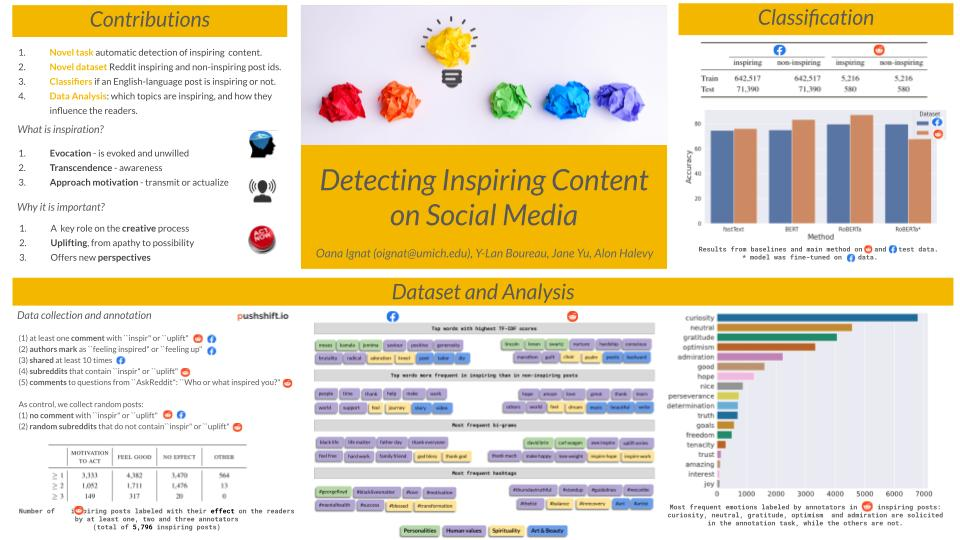

Detecting Inspiring Content on Social Media
=================================================================================
Oana Ignat, Y-Lan Boureau, Jane Yu, Alon Halevy

This repository contains the dataset and code for our paper, published at the [International Conference on Affective Computing and Intelligent Interaction (ACII) 2021](https://www.acii-conf.net/2021/):

[Detecting Inspiring Content on Social Media](https://www.computer.org/csdl/proceedings-article/acii/2021/09597431/1yylfqgb0Xe) 

## Task Description

The goal of this research is to develop models that can recognize whether a post on social media is likely to inspire someone who reads that post.

## Data
* The submission/post ids of the inspiring and non-inspiring posts we collect for our paper: [`data_all_post_ids.csv`](data_all_post_ids.csv)

* The AMT annotations for emotions and reasons for the inspiring posts, from all 3 annotators per post: [`annotations_inspir_data`](annotations_inspir_data.json)
```json
 "18ypya": {
    "reasons": {
      "feel good": 1,
      "influence": 1,
      "none": 1
    },
    "emotions": {
      "curiosity": 2,
      "gratitude": 1,
      "optimism": 1,
      "other: goals": 1
    },
...
```
* Each post is annotated by 3 annotators: we collect each of the annotated emotions/ reasons selected by the annotators and by 
how many annotators was selected. The annotators also have the option of adding other emotions/ reasons: they appear in our data
starting with "other: ".

* We cannot share the text posts, only the post ids, because of privacy concerns. 
However, you can *download all the post information* from the post ids using a reddit crawler (pushift or praw). We show below an example using pushift.

## Data Crawler
The code for crawling Reddit: [`collect_reddit_data.ipynb`](collect_reddit_data.ipynb)

## Annotation Details

#### We filter the data using the following heuristics: 
* (1) public posts with at least one comment that contains the substrings ``inspir`` or ``uplift`` (Reddit \& Facebook) 
* (2) public posts that authors mark as ``feeling inspired`` or ``feeling up`` (Facebook)
* (3) public posts that are shared at least 10 times (Facebook)
* (4) public posts from the subreddits that contain the substrings ``inspir`` or ``uplift`` (Reddit)
* (5) comments to the following four questions from the ``AskReddit`` subreddit:  
``When was the last time you felt inspired?``, ``Who or what inspired you?``, ``Who inspired you and how?``, 
``What is the most inspiring thing you have ever seen or heard?``  (Reddit).

As control, we also collect random posts: 
* (1) posts with no comment that contains the substrings ``inspir`` or ``uplift`` (Reddit \& Facebook)
* (2) posts from random subreddits that do not contain the substrings ``inspir`` or ``uplift`` (Reddit)

#### The resulting posts are annotated by crowd-sourced workers  to determine: 
* (1) whether the post is inspiring or not; 
* (2) if the post is inspiring, what influence it has on the reader; 
* (3) what emotions it evokes; 
* (4) the annotator's confidence in the answer.

## Citation information
If you use this dataset or any ideas based on the associated research article, please cite the following:

```bibtex
@INPROCEEDINGS {9597431,
author = {O. Ignat and Y. Boureau and J. A. Yu and A. Halevy},
booktitle = {2021 9th International Conference on Affective Computing and Intelligent Interaction (ACII)},
title = {Detecting Inspiring Content on Social Media},
year = {2021},
volume = {},
issn = {},
pages = {1-8},
keywords = {affective computing;social networking (online);psychology;transforms;machine learning;media;linguistics},
doi = {10.1109/ACII52823.2021.9597431},
url = {https://doi.ieeecomputersociety.org/10.1109/ACII52823.2021.9597431},
publisher = {IEEE Computer Society},
address = {Los Alamitos, CA, USA},
month = {oct}
}
```